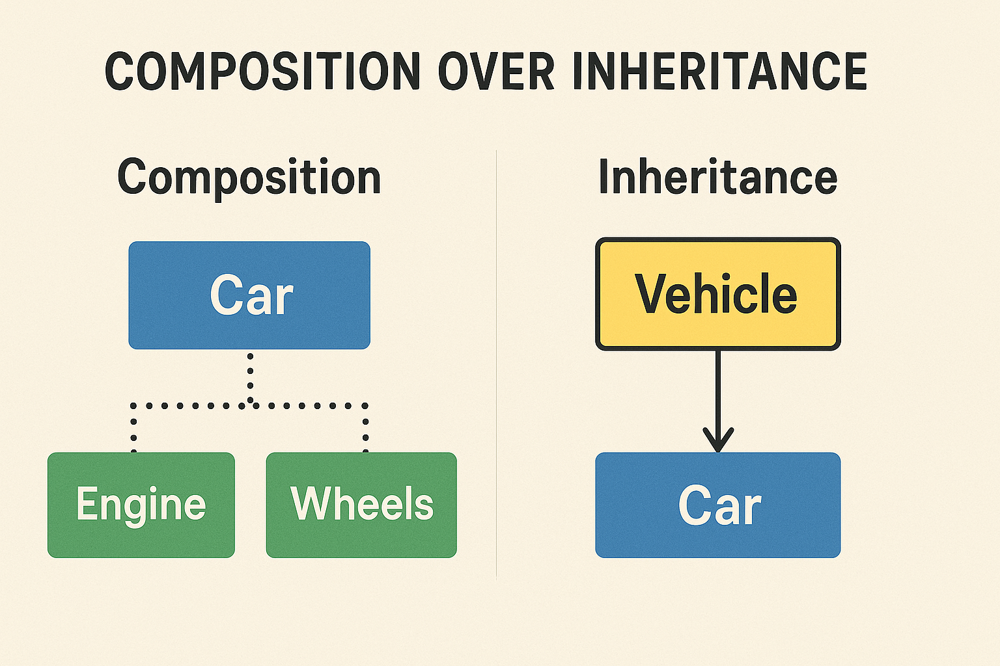

<style>
section {
  padding-bottom: 20%;
}
</style>

# Why Not Go?

## Understanding Go's Limitations and Trade-offs

Peter Preeper
2025-06-18
ppreeper@gmail.com

---

# Common Criticisms

1. No generics (pre-Go 1.18)
2. Limited object-oriented features
3. Error handling verbosity
4. Package management challenges
5. Runtime overhead compared to C/C++

<!--
Generics: While added in 1.18, older codebases still don't use them. Discuss migration challenges.

OOP Limitations: Explain composition over inheritance and why Go made this choice.

Error Handling: Share real-world examples of error handling patterns and mitigation strategies.

Package Management: Evolution from GOPATH to modules, common pitfalls to avoid.

Performance: Discuss specific scenarios where GC overhead matters vs. where it's negligible.

Note: Use these points to facilitate audience discussion about their experiences with these limitations.
-->

---

# Error Handling Issues

```go
err := doSomething();
if err != nil {
    return err
}
```

- Repetitive error checking
- Verbose error handling patterns
- Can lead to deeply nested code
- No stack traces by default

---

## Solutions for Stack Traces

- Use `runtime/debug.Stack()`
- Enable with `GOTRACEBACK=all`
- Wrap errors with `fmt.Errorf()`
- Third-party packages like:
  - `github.com/pkg/errors`
  - `golang.org/x/xerrors`

---

## Error as Values vs Try/Catch

---

```go
func processData() error {
    file, err := os.Open("data.txt")
    if err != nil {
        return fmt.Errorf("failed to open file: %w", err)
    }
    defer file.Close()

    scanner := bufio.NewScanner(file)
    for scanner.Scan() {
        data, err := parseData(scanner.Text())
        if err != nil {
            return fmt.Errorf("failed to parse data: %w", err)
        }

        if err := validateData(data); err != nil {
            if err := logError(err); err != nil {
                return fmt.Errorf("failed to log error: %w", err)
            }
            return fmt.Errorf("failed to validate data: %w", err)
        }
    }
    return scanner.Err()
}
```

<!--
- Each error check adds indentation level
- Error handling blocks stack up
- Makes code harder to read and maintain
- Alternative: flat error handling with early returns
-->

---

```python
def process_data():
    try:
        with open("data.txt", "r") as file:
            for line in file:
                try:
                    data = parse_data(line.strip())
                    try:
                        validate_data(data)
                    except Exception as e:
                        try:
                            log_error(e)
                        except Exception as le:
                            raise Exception(f"Failed to log error: {le}") from le
                        raise Exception(f"Failed to validate data: {e}") from e
                except Exception as e:
                    raise Exception(f"Failed to parse data: {e}") from e
    except Exception as e:
        raise Exception(f"Failed to open file: {e}") from e
```

---

# OOP??

## Composition vs. Inheritance

---



<!--

Let me explain the difference between composition and inheritance using the car example.

Inheritance ("is-a" relationship)
In inheritance, a Car "is-a" Vehicle. The Car inherits properties and behaviors from the Vehicle base class.

Composition ("has-a" relationship)
In composition, a Car "has-a" Engine and "has-a" set of Wheels. These are separate components that make up the Car.

Key Differences:

Flexibility: Composition is more flexible because you can change components easily. With inheritance, changing base class behavior affects all derived classes

Coupling: Inheritance creates tight coupling between parent and child. Composition creates looser coupling between components

Reusability: With composition, you can reuse components in different contexts (e.g., same Engine class in Car and Boat). Inheritance may force you to inherit unnecessary properties/methods

Maintenance: Composition is often easier to maintain as changes to components don't affect the container. Changes to base class in inheritance can have unexpected effects on derived classes

The general rule is: "Favor composition over inheritance" because it leads to more flexible and maintainable code.

-->

---

## Composition vs. Inheritance Example

---

### Inheritance (Less Flexible)

```go
type Vehicle struct {
    Speed int
}

type Car struct {
    Vehicle    // Inherits from Vehicle
}
```

- Car is tightly coupled to Vehicle
- Changes in Vehicle affect all cars
- Limited to single inheritance

---

<style>
code {
  font-size: 60%;
}
</style>

### Composition (More Flexible)

```go
type Engine struct {
    Power int
}

type Wheel struct {
    Size int
}

type Car struct {
    engine Engine
    wheels [4]Wheel
}
```

- Car has an engine and wheels
- Components can be changed independently
- More flexible and maintainable

---

## Missing Features

- No function/operator overloading
- No implicit type conversion
- No exceptions (only error values)
- Limited metaprogramming capabilities
- No direct inheritance

<!--
- Function/Operator Overloading: Discuss how Go's simplicity-first approach means explicitly different functions for different types.
- Type Conversion: Explain how explicit conversions improve code clarity but can be verbose.
- Error Values vs Exceptions: Compare recovery patterns and error wrapping in Go against try-catch patterns.
- Metaprogramming: Show how reflection and code generation are used to work around limitations.
- Inheritance: Demonstrate composition patterns that achieve similar goals to inheritance.

Note: Each limitation often has a Go-specific pattern or solution worth exploring with examples.
-->

---

# Memory Management Trade-offs

- GC pauses can impact latency
- No manual memory management
- Limited control over memory layout
- Higher memory usage than C/C++

<!--
Common GC Languages and Their Impact:

Java: HotSpot GC with multiple collectors (G1, ZGC)
- Stop-the-world pauses can be significant
- Mature tuning options available
- Memory overhead ~2-5x

Python: Reference counting + cycle collector
- Can be slower due to interpreter overhead
- GC less noticeable due to overall performance profile
- Memory overhead can be high

JavaScript (V8):
- Generational collector with incremental marking
- Short pauses but higher CPU usage
- Memory usage varies widely

C#: .NET GC
- Generational collector
- Concurrent and background GC options
- Similar pause times to Java

Go's GC optimizes for latency over throughput, making it suitable for services
-->

---

# Development Speed

- Compilation is fast but not instant
- Verbose code compared to Python/Ruby
- Limited framework ecosystem
- Steeper learning curve for some concepts

---

# Use Cases Where Go Might Not Fit

1. CPU-intensive applications
2. Complex mathematical computations
3. GUI applications
4. Embedded systems
5. Real-time systems

---

# Alternative Languages to Consider

- Rust: For systems programming
- Python: For rapid development
- Java: For enterprise applications
- C++: For performance-critical systems
- Node.js: For web applications

<!--
Major drawbacks for each alternative:

Rust: Steep learning curve and complex ownership model that can frustrate new developers
Python: Poor performance and GIL limitations in multi-threaded applications
Java: Significant memory overhead and slow startup times
C++: Complex language features and high risk of memory-related bugs
Node.js: Single-threaded nature and callback hell in complex async operations

Note: Each language has its specific use cases where these drawbacks might be acceptable or irrelevant.
-->

---

# Conclusion

- Go is excellent for certain use cases
- But consider alternatives when:
  - Complex type systems needed
  - Performance is critical
  - Rich ecosystem required
  - Team expertise lies elsewhere

## It Depends: 🤷

---

## Q&A

- Questions? Let’s discuss!

---

## About Me

- Name: Peter Preeper
- Contact: ppreeper@gmail.com
- I Work For: Thinksoft Inc.
- Job Title: Senior Implementation Specialist
