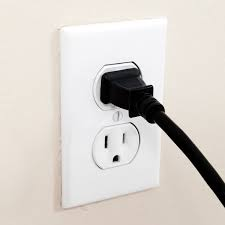
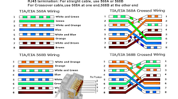

<style>
section {
  padding-bottom: 20%;
}
</style>

# Interfaces in Go

Peter Preeper
2025-10-15
ppreeper@gmail.com

---

# 1 Introduction & Why Interfaces?

---

## 1.1 What is an Interface?

- In Go, an interface is a named collection of method signatures.

  - It defines a contract for behavior.

- They are behavioral contracts, not data structures.
  - They say what a type can do, not what it contains.

---

## 1.2 The Go Philosophy: Duck Typing

"If it walks like a duck and quacks like a duck, then it is a duck."

Go achieves polymorphism by focusing on behavior (methods) rather than explicit inheritance hierarchies.

---

## 1.3 Key Benefits

- _Loose Coupling_: The definition of a contract is separate from its implementation.

- _Flexibility_: Easily swap different implementations of the same behavior
  - e.g., swapping a production database with an in-memory mock for testing

---

# 2 The Basics: Defining and Satisfying

---

## 2.1 Defining an Interface

Define an interface with the type keyword and a set of method signatures.

```go
type Shaper interface {
	Area() float64
	Perimeter() float64
}
```

---

## 2.2 Implicit Implementation

This is the core differentiator in Go. A concrete type (usually a struct) implicitly satisfies an interface if it implements **all** the methods defined in that interface. No implements keyword is necessary.

```go
// The Rectangle struct implements the Shaper interface
type Rectangle struct {
	Width, Height float64
}

func (r Rectangle) Area() float64 {
	return r.Width * r.Height
}

func (r Rectangle) Perimeter() float64 {
	return 2 * (r.Width + r.Height)
}
```

---

## 2.3 Interface Values and Method Receivers

- An interface variable holds two things: the **concrete type** of the value and the value itself.

- Receiver Rules: A value of type `T` can satisfy an interface only if **all** required methods are defined with a _value_ receiver (`(t T)`). A value of type `*T` (a pointer) can satisfy an interface if **any** required methods are defined with a _pointer_ receiver (`(t *T)`).

---

# 3 Practical Use Cases & Idioms

---

## 3.1 Small Interfaces (The Go Idiom)

Go prefers small, single-method interfaces (Interface Segregation Principle).

- **Example: Standard Library**

- `io.Reader`: `Read(p []byte) (n int, err error)`
- `io.Writer`: `Write(p []byte) (n int, err error)`
- Interfaces like `io.ReadWriter` are simply compositions of smaller ones.

---

### Simple interface



---

### Complex Interface



---

## 3.2 Dependency Injection

Interfaces allow you to write functions that depend on a behavior rather than a concrete type. This is fundamental for testable code.

- **Scenario:** A `Service` needs to save data.

- _Bad_: Depends on a concrete `Database` struct.
- _Good_: Depends on a `DataStore` interface with a `Save()` method.
- In tests, you can pass a **MockDataStore** that implements the interface, verifying the `Save()` method was called without hitting an actual database.

---

## 3.3 The Empty Interface (`interface{}` or `any`)

- The empty interface has **zero** methods. **Every single type** implicitly satisfies the empty interface.
- It is used to hold a value of _any_ type, similar to `Object` in Java or C#'s `dynamic`.
- **Modern Go (1.18+)**: The type alias `any` is the preferred, more readable name for `interface{}`.
- _Use with caution_: It sacrifices static type safety, requiring type assertions or type switches to retrieve the original type.

---

# 4 Under the Hood: How it Works

---

## 4.1 The Interface Value Structure

An interface value is conceptually a two-word structure (or a pair of pointers):

- **Type** (`itab` or `_type`): A pointer to the description of the **concrete type** currently held (e.g., `*Rectangle`). This enables **dynamic dispatch**.
- **Value** (`data`): A pointer to the **actual data** of the concrete value (e.g., the `Rectangle` instance).

---

## 4.2 Dynamic Dispatch

When you call an interface method (e.g., `s.Area()`), the runtime:

1. Looks at the **Type** pointer.
2. Finds the function table for the concrete type (e.g., `Rectangle.Area`).
3. Calls the concrete function through the **Value** pointer.

---

## 4.3 Type Assertions and Type Switches

These mechanisms allow you to inspect the concrete type inside an interface value.

- **Type Assertion (with Comma-Ok Idiom)**

```go
v, ok := i.(Rectangle)
if ok {
	// 'i' is indeed a Rectangle, 'v' is the concrete value
}
```

---

## 4.3 Type Assertions and Type Switches ...

- **Type Switch**

```go
switch v := i.(type) {
	case Rectangle:
		// 'v' is a Rectangle
	case Circle:
		// 'v' is a Circle
	default:
		// Type is unknown
}
```

---

# 5 Conclusion

- Key Takeaways

  - Interfaces are **contracts** defined by methods.
  - Implementation is **implicit** (no `implements` keyword).
  - Go prefers **small interfaces** for composability.
  - They are the foundation for Go's flexibility, testing, and dependency injection.

- Final Thought: Think about behavior first.
  - What does a piece of code need to do?
  - That defines your interface.

---

# Further ...

You can learn more about how interfaces are implicitly satisfied by checking out this video: [Go Interfaces Explained](https://www.youtube.com/watch?v=HZiF5yrtXHk)

---

# Q&A

- Questions? Let’s discuss!

---

## About Me

- Name: Peter Preeper
- Contact: ppreeper@gmail.com
- I Work For: Thinksoft Inc.
- Job Title: Senior Implementation Specialist
